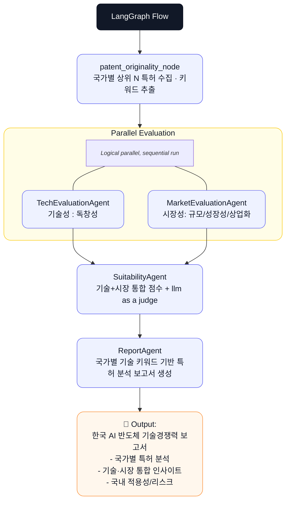

# 🇰🇷 AI 반도체 특허 경쟁력 평가 에이전트

> 본 프로젝트는 AI 반도체 분야의 글로벌 특허 데이터를 자동 수집·평가하여,  
> **한국의 기술 경쟁력과 산업 전략 수립에 필요한 인사이트를 실시간으로 제공하는**  
> **AI Agent 기반 분석·보고서 생성 시스템**입니다.

---

## 📌 SUMMARY

### 🎯 Objective

- **AI 반도체 분야 특허의 기술 경쟁력 및 시장성 평가**
- **한국의 기술 자립 및 산업 전략 수립을 위한 데이터 기반 보고서 자동 생성**

### ⚙️ Methods

- LangGraph 기반 Multi-Agent Orchestration
- Patent Retrieval(Search) → Evaluation → Synthesis → Report Generation Pipeline

### 🧰 Tools

- LangGraph, LangChain, OpenAI GPT-4o, SerpAPI, Tavily, Python, ChromaDB

---

## 1️⃣ 서비스 개요

본 서비스는 **AI 반도체(AI Chip)** 관련 최신 특허를 자동으로 수집하고,  
각 특허의 **기술성·시장성·적합성**을 평가하여  
국가별 기술경쟁력을 비교하는 **자동 보고서 생성 시스템**입니다.

- LangGraph 기반의 멀티 에이전트 구조로, 특허 검색 → 평가 → 보고서 생성을 주기적으로 자동화
- 궁극적으로는 **한국의 기술 경쟁력 강화를 위한 실시간 특허 인텔리전스 도구**로 발전 기대

---

## 2️⃣ 제안 배경 (AS-IS)

AI 반도체 산업은 **GPU·NPU·PIM 등 차세대 연산 아키텍처의 경쟁 가속화**로  
글로벌 특허 출원이 폭발적으로 증가하고 있습니다.  
그러나 이러한 확산 속에서도 **산업 전반의 정보 접근성과 분석 효율성에는 한계**가 있습니다.

- 다양한 기술 트렌드(HBM, QPU 등) 병렬 발전 → **특허 간 편차 및 핵심 기술 식별의 어려움**
- **엔비디아 중심 생태계**에서 신흥 기업의 **화이트 스페이스 전략** 평가 한계
- 구글, 아마존 등은 독자 AI칩을 대규모 개발 중이나,  
  **기술 방향성 및 트렌드를 종합 분석하는 체계 부재**

> 이성용. (2025년 9월 1일). *"AI 반도체 패권 흔들리나"… 엔비디아 독주에 맞선 스타트업들의 '특허 전쟁'*. 특허뉴스. https://e-patentnews.com/13284
---

## 3️⃣ 필요성 및 목적 (TO-BE)

### 🔹 What

> 국가별 최신 AI 반도체 특허를 자동 분석하고,  
> **한국의 기술 포지션과 기술 격차를 시각화한 리포트 생성**

### 🔹 Why

- 특허는 **매일 공개**되므로, 기존의 **정적 분석 방식은 한계**
- **최신 특허 흐름 기반 인사이트**가 정책·투자 판단의 핵심
- **지속 모니터링·자동 평가·리포트화**가 가능한 AI 에이전트 구조 필요

### 🔹 How

- LangGraph 기반 **루프 자동화 시스템**
  - 특허 수집 → 기술/시장 평가 → 통합 적합성 판단 → 리포트 생성

---

## 4️⃣ FEATURES

- 🔍 **특허 검색 자동화** : SerpAPI로 ‘AI 반도체’ 하위 키워드 기반 최신 특허 수집
- 🧠 **기술성 평가** : LLM을 활용한 기술 독창성 점수화 (0~1)
- 💡 **시장성 평가** : 기술 적용 산업 및 시장 성장 가능성 분석(0~1)
- ⚖️ **적합성 판단** : 기술성+시장성 결과 종합, LLM as a judge
- 📄 **보고서 생성** : “한국의 AI 반도체 기술 경쟁력 보고서” PDF 자동 생성

---

## 5️⃣ TECH STACK

| Category         | Details                               |
|------------------|---------------------------------------|
| **Framework**    | LangGraph, LangChain                  |
| **Language**     | Python 3.11                           |
| **LLM**          | GPT-4o-mini (via OpenAI)              |
| **Retrieval**    | ChromaDB                              |
| **Embedding**    | Jina Embeddings v2 Base-ko            |
| **External API** | SerpAPI (Google Patents)              |
| **Web Search**   | Tavily                                |

---

## 6️⃣ STATE 구조

| State | 주요 필드 | 설명 |
|--------|------------|------|
| **PatentState** | `tech_name`, `country`, `query`, `items[]`, `top_items[]` | 국가별 상위 N 특허 수집, 초록 요약 및 핵심 키워드 추출 |
| **TechState** | `target_patent_id`, `originality_score`, `cpc_distribution{}`, `statistics{}` | 기술 독창성 평가 |
| **MarketState** | `market_size_score`, `growth_potential_score`, `commercialization_readiness`, `market_score`, `application_domains[]` | 시장 규모·성장성·사업화 가능성 평가 |
| **SuitabilityState** | `suitability_score`, `final_grade`, `score_breakdown{}`, `evaluation_summary` | 기술/시장 통합 적합성 판단 |
| **ReportState** | `report_title`, `report_generated_at`, `avg_originality_score`, `avg_market_score`, `grade_distribution{}` | 최종 보고서 생성 및 통계 요약 |
| **WorkflowState** | *(생략)* | 전체 워크플로우 상태 통합 |

---

## 7️⃣ AGENTS

| Agent | 역할 | 출력(STATE) |
|--------|------|--------------|
| **PatentSearchAgent** | ‘AI 반도체’ 최신 글로벌 특허 수집 (국가별 상위 N) + 초록 한국어 요약 + 키워드 추출 | `PatentState` |
| **TechEvaluationAgent** | 기술 독창성 평가 (0~1점) | `OriginalityState` |
| **MarketEvaluationAgent** | 시장 규모·성장성 평가 (0~1점) | `MarketState` |
| **SuitabilityAgent** | 기술 + 시장 통합 적합성 판단 및 유망 특허 선별 | `SuitabilityState` |
| **ReportAgent** | 모든 State(Patent/Tech/Market/Suitability)를 참조하여 본문 생성 및 파일 저장 | `ReportState` |

---

## 8️⃣ **EVALUATION METRICS**

### 1. **기술성 지표 (patent_originality_node)**

> Originality Index (독창성 지표)

- **(Reference)** 본 에이전트는 **특허의 기술적 독창성**을 정량화하기 위해 아주대학교 박상영·이성주(2020)의 *「특허기반의 산학협력 유망분야 도출 방법 연구」* 에서 제안한 **독창성 지표(Originality Index)** 공식을 참고하였습니다.

- **(수식)**

  $$
  Originality_i = 1 - \sum_{k=1}^{n_i} \left( \frac{NCITED_{ik}}{NCITED_i} \right)^2
  $$

  - (NCITED_{ik}): i번째 특허가 인용한 k번째 기술분류(CPC)의 인용 횟수  
  - (NCITED_i): i번째 특허의 전체 인용 수  
  - 값의 범위: 0~1  
    - 0에 가까움 → 단일 분야 집중 (낮은 독창성)  
    - 1에 가까움 → 다양한 분야 융합 (높은 독창성)

- (**Agent 계산 로직 요약)**

  | 단계 | 수행 내용 | 결과 |
  | --- | --- | --- |
  | 1️⃣ | 대상 특허의 인용 특허 리스트 수집 | 인용 특허 집합 |
  | 2️⃣ | 인용 특허의 CPC 코드 추출 | 기술 분류 분포 |
  | 3️⃣ | 각 CPC별 인용 빈도 계산 | 비율 pₖ 산출 |
  | 4️⃣ | Originality = 1 - Σ(pₖ²) 계산 | 독창성 점수 |

- **구현 메모 (CPC 확장 검색 로직)**  
  1️⃣ SerpAPI로 인용 특허의 CPC 코드 추출  
  2️⃣ 각 CPC를 **LLM(GPT-4o-mini)** 로 기술명 키워드로 변환  
  3️⃣ 변환된 키워드로 SerpAPI 재검색 후 CPC 재수집  
  4️⃣ 전체 CPC 분포 기반으로 Originality 계산  

---

### 2. **성장성 지표 (MarketSizeGrowthAgent)**

- 본 에이전트는 **특허의 시장성 및 상업화 가능성을 정량화**하기 위해 아래와 같은 **시장성 점수(Market Score)** 공식을 사용합니다.
- **(수식)**  

$$
MarketScore_i = MarketSize_i + GrowthPotential_i + Commercialization_i
$$
- **(세부 구성 요소)**

  | 구성 요소 | 점수 범위 | 설명 |
  | --- | --- | --- |
  | **MarketSize** | 0 ~ 0.4 | 특허가 실제 적용 가능한 세부 시장 규모 (SAM) |
  | **GrowthPotential** | 0 ~ 0.3 | 해당 시장의 연평균 성장률 (CAGR) 또는 구체적 성장 수치 |
  | **Commercialization** | 0 ~ 0.3 | 상용화 가능 시점 및 기술 성숙도 |
  | **총점** | **0 ~ 1.0** | 최종 시장성 점수 |

- **세부 점수 산정 기준**

  **Market Size (시장 규모, 0~0.4)**  

  | 점수 | 적용 가능 시장 (SAM) | 예시 |
  | --- | --- | --- |
  | 0.35~0.4 | \$10B 이상 | LLM 훈련 인프라 \$12B, 클라우드 추론 가속 \$18B |
  | 0.25~0.35 | \$3B~\$10B | 추천시스템 임베딩 \$5B, 음성인식 가속 \$6B |
  | 0.15~0.25 | \$1B~\$3B | 특정 모델 최적화 \$1.5B |
  | 0.1~0.15 | \$300M~\$1B | 의료 영상 전용 NPU \$800M |
  | 0~0.1 | \$300M 미만 | 실험적 기술, 초기 POC |

  **Growth Potential (성장 잠재력, 0~0.3)**  

  | 점수 | CAGR / 성장 예측 | 예시 |
  | --- | --- | --- |
  | 0.25~0.3 | 25%+ / 5년간 2배+ | “2025년 310억 → 2029년 602억 달러” |
  | 0.2~0.25 | 20~25% | “CAGR 23%, 5년간 1.8배” |
  | 0.15~0.2 | 15~20% | “연 17% 지속 성장” |
  | 0.1~0.15 | 10~15% | “CAGR 11%” |
  | 0~0.1 | <10% | 정체 또는 감소 |

  **Commercialization Readiness (상용화 준비도, 0~0.3)**  

  | 점수 | 상용화 시점 | 특징 |
  | --- | --- | --- |
  | 0.25~0.3 | 즉시~1년 | 기존 제품 개선, 명확한 고객 |
  | 0.2~0.25 | 1~2년 | 프로토타입 검증 완료 |
  | 0.15~0.2 | 2~3년 | 파일럿 단계 |
  | 0.1~0.15 | 3~5년 | 초기 R&D, 표준화 필요 |
  | 0~0.1 | 5년+ | 상업화 경로 불명확 |

- **하이브리드 검색 로직 (RAG + Web Search)**  
  - **RAG 검색:**  
    - Semantic Search (Chroma Vector DB, Top-4)  
    - BM25 Keyword Search (Top-4)  
    - 쿼리 예시: `"NPU embedding table machine learning market size growth"`  
  - **Tavily Web Search:**  
    1️⃣ `"{tech} {keyterm} market size 2024 2025 billion USD"`  
    2️⃣ `"{tech} {keyterm} CAGR growth rate forecast 2024-2028"`  
    3️⃣ `"{tech} application market forecast"`  
    
  - **LLM 점수 산정:**  
    - Abstract (특허 기술 내용)  
    - RAG 문서 (시장 보고서 참고)  
    - Tavily 결과 (정량 수치 활용, 예: “602억 달러”, “CAGR 11%”)

---

### 3. **적합성 지표 (SuitabilityAgent)**
- 독창성 점수(Originality)와 시장성 점수(Market)를 종합하여 **특허 기술의 최종 지속가능성(Sustainability)** 점수를 산정하고, **LLM-as-a-Judge**를 통해 투자 의사결정을 지원합니다.  
  - **1차 평가 (수식 기반)**: 빠른 정량적 계산  
  - **2차 평가 (LLM Judge)**: GPT-4가 점수를 해석하고 전략적 조언 제공  

- **(1차 평가)**  

$$
SustainabilityScore = (Originality_{norm} \times 0.55) + (Market \times 0.45)
$$
  - **가중치 설계 근거:**  
    - **독창성 55%:** 기술적 독창성의 중요성 반영 (정규화)  
    - **시장성 45%:** 시장 잠재력의 중요성 반영  
  - **등급 체계:**

    | 등급 | 점수 범위 | 설명 |
    | --- | --- | --- |
    | **S** | 0.85 ~ 1.0 | Excellent (탁월) |
    | **A** | 0.70 ~ 0.85 | Very Good (매우 우수) |
    | **B** | 0.55 ~ 0.70 | Good (우수) |
    | **C** | 0.40 ~ 0.55 | Fair (보통) |
    | **D** | 0.0 ~ 0.40 | Poor (낮음) |

- **(2차 평가)**  
  - **GPT-4 Judge의 역할:**  
    1️⃣ 점수 해석 — 단순 수치 이상의 의미 분석  
    2️⃣ 맥락 이해 — 기술성과 시장성의 상호 관계 파악  
    3️⃣ 전략 제안 — 개선 또는 투자 우선순위 도출  
    4️⃣ 등급 재조정 — 필요 시 정량 결과 보정  

---
## 9️⃣ ARCHITECTURE



---
## 🔟 OUTPUT ToC (Report 목차)

### 1. SUMMARY
- 분석 대상 기술군의 종합 경쟁력 요약  
- 평균 점수 및 등급 분포를 통한 기술·시장 트렌드 요약  
- 기술 강점 및 개선이 필요한 영역 도출  

### 2. DETAIL ANALYSIS
- 특허별 상세 평가 결과  
  - 각 특허의 제목, 식별번호, 기술 개요  
  - 기술 독창성(Originality) 및 시장성(Market Score) 세부 점수  
  - **Investment Analysis**  
    - 투자 권고(Recommendation), 리스크 수준(Risk Level), LLM 기반 정성 평가 근거(Rationale)  

### 3. COUNTRY COMPARISON
- 국가별 통계 및 성과 지표(특허 수, 평균 점수, 상위 등급 비율 등)  
- 국가별 상세 비교(핵심 지표, 강·약점 하이라이트) 및 등급 분포  

### 4. TECHNOLOGY GAP ANALYSIS
- 한국 기준 베이스라인 점수(Originality / Market / Suitability)  
- 국가 간 기술 격차(Orig / Market / Suit / Overall Gap) 및 상태(Leading / Following 등)  
- 전략적 시사점 및 권고사항(로드맵 / 파트너십 / GTM 전략 등)  

### 5. REFERENCE
- 분석에 활용된 특허 데이터 및 외부 시장자료 출처 목록  
- 데이터 수집·평가 방법론 (**RAG + Tavily 하이브리드 검색 기반**)  
- 주요 참고 문헌 및 시장 리포트 출처  
- 보고서 생성 정보 (생성일, 분석 대상, Agent 구조 등)  

### 6. APPENDIX
- 평가 지표 및 점수화 기준 공식  
- Multi-Agent 분석 프로세스 설명  

---
## 1️⃣1️⃣ DIRECTORY STRUCTURE


```markdown
Patent-analysis-report/
├── agents/                          # 에이전트 로직
│   ├── __init__.py
│   ├── market_size_growth_agent.py  # 시장 규모/성장성 분석
│   ├── patent_originality_agent.py  # 특허 독창성 분석
│   ├── patent_search_agent.py       # 특허 수집/검색
│   ├── report_agent.py              # 종합 보고서 생성
│   └── suitability_agent.py         # 적합성 평가
├── data/                            # 레퍼런스 데이터(PDF 등)
│   └── (MVP용 PDF 자료 2건)
├── fonts/                           # 보고서 폰트
│   └── (나눔고딕 폰트)
├── output/                          # 산출물(중간 결과/리포트)
│   ├── market_evaluation/
│   ├── originality/
│   ├── patent_search/
│   ├── reports/
│   ├── suitability/
│   └── summary/
├── rag/                             # RAG 인덱스 스크립트
│   ├── __init__.py
│   ├── build_index.py               # 시장성 분석용 데이터 인덱스
│   ├── chroma/
│   ├── indexes/
│   └── report_build_index.py        # 리포트 생성용 데이터 인덱스
├── state/                           # 상태(State) 모델
│   ├── __init__.py
│   ├── market_state.py
│   ├── originality_state.py
│   ├── patent_state.py
│   ├── report_state.py
│   ├── search_state.py
│   ├── suitability_state.py
│   └── workflow_state.py
├── .env
├── .gitignore
├── __init__.py
├── main.py
├── README.md
└── requirements.txt
```

---

## 🤝 CONTRIBUTORS

- **권예지 (Yeji Kwon)**  
    | 항목 | 내용 |
    | --- | --- |
    | 🎓 **소속 (Affiliation)** | SKALA AI Bootcamp 2기 3반 / 팀 코드 **SK064** |
    | 💻 **Role** | Project Lead — Multi-Agent System & Patent Analysis Pipeline |
    | ✉️ **Email** | [yejrhdwn@naver.com](mailto:yejrhdwn@naver.com) |
    | 🌐 **GitHub** | [github.com/yejirhdwn](https://github.com/yejirhdwn) |
    | 🧩 **주요 담당 (Key Contributions)** | • LangGraph 기반 에이전트 오케스트레이션 설계<br>• 전체 파이프라인 구조 및 RAG 검색·평가 로직 구축<br>• 자동 보고서 생성 시스템 개발 및 통합 운영 |

---

## 🧩 CONCLUSION

본 프로젝트는 **AI 반도체 산업의 기술 경쟁력 분석을 자동화**하기 위한 목적으로 시행되었습니다.  
LangGraph 기반의 에이전트 체계를 통해 단일 실행만으로 “최신 특허 수집 → 평가 → 보고서 생성”까지 수행할 수 있으며,  
향후에는 **Airflow 등 워크플로 자동화 도구를 활용해 주기적 재분석 및 정책기관용 리포트 대시보드**로 확장될 수 있습니다.
